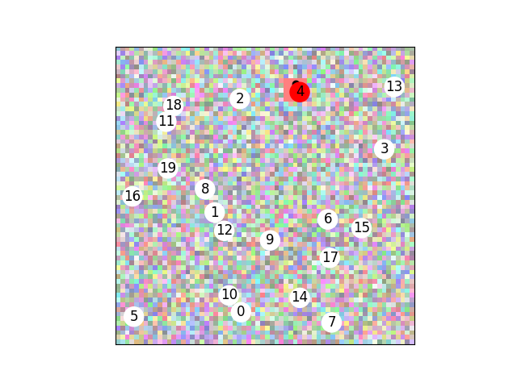
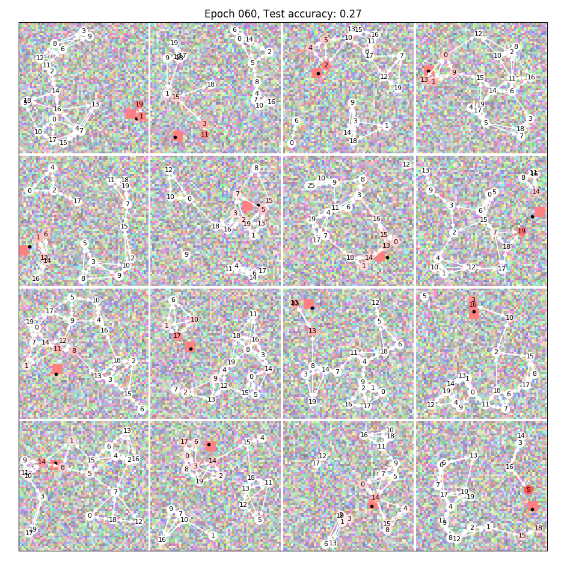
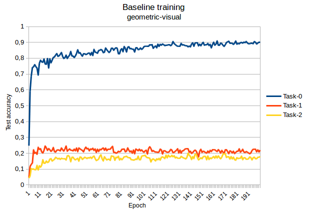
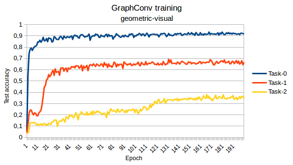
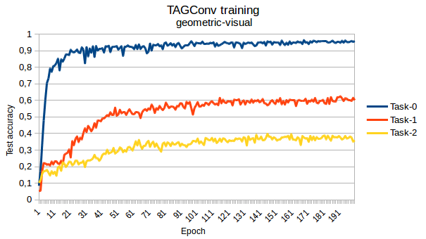

# Geometric Visual: find the n-th closest node

We solve a task mixing a visual input with message passing between nodes.

While we can define many different tasks from this repository's code, we choose a simple one: "Who is the n-th closest node to a visual clue?"

(keywords: torch_geometric, pytorch, torch, graphconv, graph, dataset, python, machine_learning, deep_learning)

## Dataset and task

This project is a simple on the fly dataset of a simple task : in a random graph with cartesian coordinates for node features, find the n-th closest node to a colored square on a random image.

See the example below:



We use the PyTorch Geometric framework. Our `Data` object provides the background image tensor, the node features and edge indexes (COO format) and the groundtruth in a "one hot" vector or simply the index.

Since we work with 0 indexed lists, finding the first closest node is Task-0

An example while learning to find the 2nd closest point (Task-1) :



We provide several functions for plotting results in `draw.py`. The color intensity from white to the target color (red) is the network output score.

## Results

We choose to fix some parameters for the dataset. While the learning rate can be adapted to the Task, we found these values work most of the time.

```python
    IM_CHANNELS = 3
    IM_HEIGHT = IM_WIDTH = 64  # proximity to the center is calculated in normalized space, so beware to use only square images for now
    NUM_NODES = 20
    RADIUS = 0.3
    MAX_NUM_NEIGHBORS = 3
    TARGET_COLOR = (1.,0.,0.)  # red
    BATCH_SIZE = 64
    AUXILIARY_TASK_WEIGHT = 3
    NUM_WORKERS = 8
    SIZE_TRAIN = 8000
    SIZE_TEST = 2000
    EPOCHS = 200
    LEARNING_RATE = 0.003  # 0.005 does well in Task-0 but unstable in Task-1
    SCHEDULER_STEP_SIZE = 20
    SCHEDULER_GAMMA = 0.75
```

Our network extracts features from the image (with a convnet similar to AlexNet), and concatenate the `image_features` vector to the node features. For this experiment we used an auxiliary task to force the image feature to be the square cartesian position (plotted with the black dot). We chose image feature extraction first to prepare for future experiences.

The baseline is a MLP outputing a score for each node looking only at the node and image feature pair.
In Task-0, the baseline reaches around 90% accuracy as it learns the distance function.
For Task-1, the baseline learns a bad distance function in the hope of being right sometimes, but goes down to 20% accuracy.

Random response gets 5% accuracy (`1/NUM_NODES`).

### Task-0 with 20 nodes

Results for an ealy version to benchmark different modules provided by PyTorch Geometric:

| Method | Acc 10e (*) | Acc 50e (*) | Acc 80e (*) | Acc 200e (1) |
| :------------- | :----------: | :-----------: | :-----------: | :-----------: |
|  Linear (baseline) | . | . | . | ~90
|  GCN max_i/max_i | 19.8 | 23.2 | 23.9 |
|  GCN mean/mean (2) | 21.4 | 28.6 | 30.0 |
|  GCN max_i/mean | 22.6 | 28.0 | 28.0 |
|  GCN mean_i/max_i | 17.1 | 24.7 | 23.8 |
|  GCN add/add | 5.8 | 31.2 | 32.6 |
|  SAGE_yn (3) | 32.3 | 32.9 | 32.5 | 33.5 |
|  SAGE_nn | 31.3 | 30.9 | 32.0 | 32.6
|  [REDO]Graph max/max | (61) | (67) | (66) |
|  Graph mean/mean | 55.0 | 66.6 | 69.0 | 69.8 |
|  Graph mean/max | . | . | . | . |
|  Graph add/add | 54.4 | 62.9 | 67.3 | 68.3 |
|  GAT h1c1 (4) | 30.6 | 33.8 | 33.3 | 34.3 |
|  [REDO]GAT h1c0 | (31) | (35) | (36) | (33.6)
|  TAG K1 (5) | 54.0 | 63.9 | 66.7 | 67.4 |
|  TAG K3 | 53.3 | 63.7 | 66.3 | 68.1
|  [REDO]TAG K9 | 5.5 | 51.9 | 59.6 | 65.8
|  SG K1 | 30.9 | 33.1 | 32.3 | 33.6
|  SG K3 | 21.9 | 20.1 | 21.9 | 21.0

- (*) Accuracy at X epochs, taken with 0.5 smoothing on tensorboard
- (1) For the values at 200 epochs, we use 0.9 smoothing
- (2) `max`/`mean`/`add` are different aggregation schemes, but `mean` provides generally better results
- (3) "SAGE y(es)n(o)" means SAGE conv with normalization first layer, but not second
- (4) GAT is h number of heads, c contenation or not
- (5) K is the number of hops for TAG or SG convs

## Final results

The baseline is two consecutive linear layers of sizes (4, 8), (8, 1):



For the [GraphConv](https://pytorch-geometric.readthedocs.io/en/latest/modules/nn.html#torch_geometric.nn.conv.GraphConv), we use 8 successive layers of size 4 (expect final size of 1):



For the [TAGConv](https://pytorch-geometric.readthedocs.io/en/latest/modules/nn.html#torch_geometric.nn.conv.TAGConv), we use 5 successive layers with K=3 and size 4:



We use LeakyReLU as the activation unit. Hyperparameters are chosen according for stability and performance.

## Training stability

We have occasional loss divergence since due to the sigmoid, sometimes a method gets "stuck" with the image_features equal to the extremes 0 or 1. To avoid this, we use a custom tanh which does not constrain the image_features between [0, 1] strictly. Could create a viz problem.
We also detach() the tensor since we are more experimenting with the message passing. But our goal was to get rid of the auxilliary loss so this is temporary.
Adding noise to the image features could be interesting.
We could benefit from replacing the softmax with a log_softmax and adapting the loss function.

## TODOs

- Create directly a batch: it is faster now to create the data on CPU, batch it then send it to GPU than creating each data point on GPU then batch. One dev could be creating a batch directly, but not a priority.
- Random target color: the auxilliary task is not our concern, it would be more visually pleasing but of no interest here
