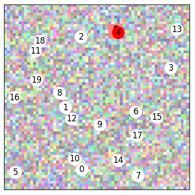

# Geometric Visual

This project is a simple on the fly dataset of a simple task : in a random graph, find the closest node to a colored square on a random image.

## The dataset

Proximity to the center is calculated in normalized space, so beware to use only square images for now.

## Results

### With 20 nodes

| Method | Acc 10e (*) | Acc 50e (*) | Acc 80e (*) | Acc 200e (1) |
| :------------- | :----------: | :-----------: | :-----------: | :-----------: |
|  Linear (baseline) | . | . | . | .
|  GCN max_i/max_i | 19.8 | 23.2 | 23.9 |
|  GCN mean/mean | 21.4 | 28.6 | 30.0 |
|  GCN max_i/mean | 22.6 | 28.0 | 28.0 |
|  GCN mean_i/max_i | 17.1 | 24.7 | 23.8 |
|  GCN add/add | 5.8 | 31.2 | 32.6 |
|  SAGE_yn | 32.3 | 32.9 | 32.5 | 33.5 |
|  SAGE_nn | 31.3 | 30.9 | 32.0 | 32.6
|  [REDO]Graph max/max | (61) | (67) | (66) |
|  Graph mean/mean | 55.0 | 66.6 | 69.0 | 69.8 |
|  Graph mean/max | . | . | . | . |
|  Graph add/add | 54.4 | 62.9 | 67.3 | 68.3 |
|  GAT h1c1 | 30.6 | 33.8 | 33.3 | 34.3 |
|  [REDO]GAT h1c0 | (31) | (35) | (36) | (33.6)
|  TAG K1 | 54.0 | 63.9 | 66.7 | 67.4 |
|  TAG K3 | 53.3 | 63.7 | 66.3 | 68.1
|  [REDO]TAG K9 | 5.5 | 51.9 | 59.6 | 65.8
|  SG K1 | 30.9 | 33.1 | 32.3 | 33.6
|  SG K3 | 21.9 | 20.1 | 21.9 | 21.0

- (*) Accuracy at X epochs, taken with 0.5 smoothing on tensorboard
- (1) For the values at 200 epochs, we use 0.9 smoothing
- () Twice GCN with improved and `aggr=max`

## TODOs

- show example
- create input directly on device
- test square center
- create directly a batch
- changing number of nodes
- show some results
- add noise to image features
- random target color
